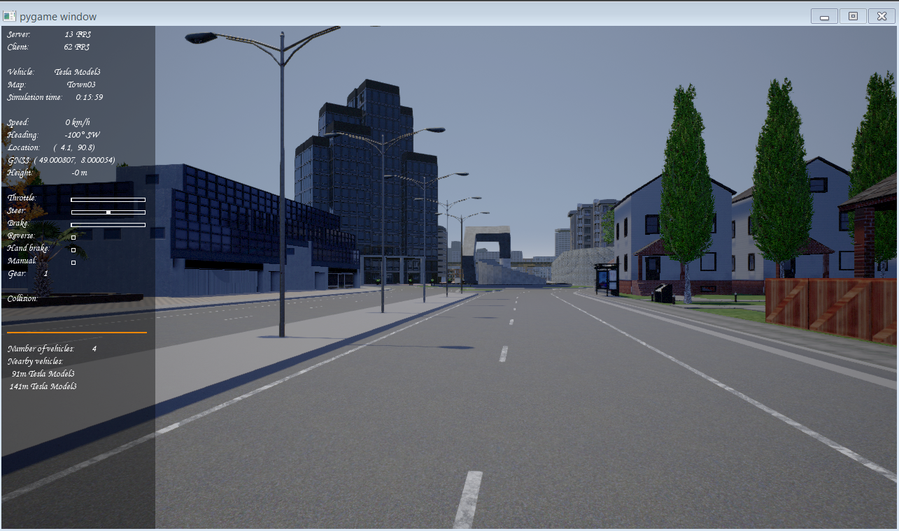

# Lane_detection

### Lane detection using computer vision

* The images are captured from CARLA Simulator using a RGB sensor that is attached to the vehicle   * These RGB images(1280, 720,3) are converted to grayscale image (1280, 720)   * Gaussian filter of size (5,5) is applied to grayscale image to remove noise by blurring the image   * Canny edge detector algorithm is apllied to find the edge in the image   * The region with lane is selected by a polygon and rest of the image is set to black   * The masked image is drawn with hough lines which is later combined with original image  

