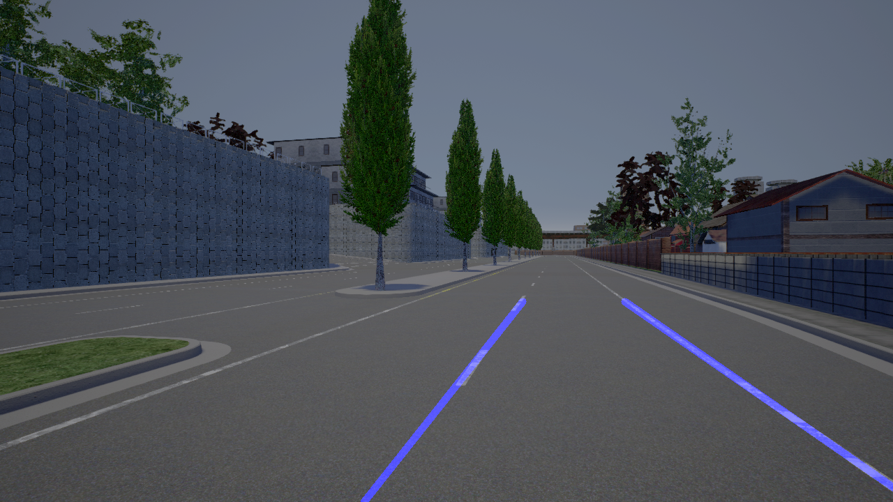
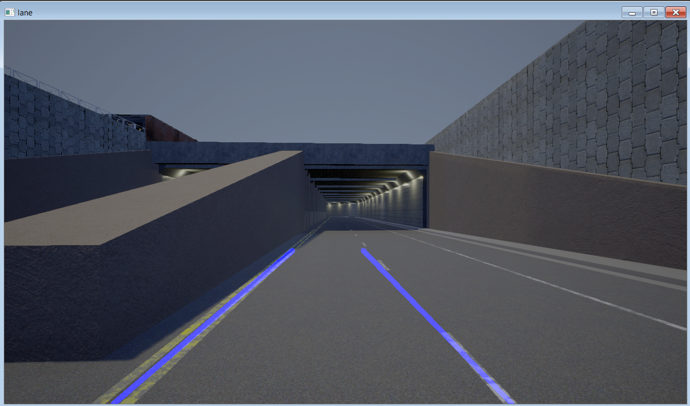

# Lane_detection

### Lane detection using computer vision

* The images are captured from CARLA Simulator using a RGB sensor that is attached to the vehicle   
* These RGB images(1280, 720,3) are converted to grayscale image (1280, 720)   
* Gaussian filter of size (5,5) is applied to grayscale image to remove noise by blurring the image  
* Canny edge detector algorithm is apllied to find the edge in the image  
* The region with lane is selected by a polygon and rest of the image is set to black   
* The masked image is drawn with hough lines which is later combined with original image  

### Getting started and Prerequisites
Install anaconda (version management control) and create a virtual environment using command 'conda create -name lane python=3.7' from anaconda prompt  
Install packages : opencv, matplotlib, numpy, glob, math
Download CARLA from http://carla.org/2019/04/03/release-0.9.5/

### Running
Download or clone this folder and run lane_detection_canny.py  
The following image shows the lane detected using lane_detection_canny.py  

  
   

#### Simultaneously reading and detecting lanes

The manual_control.py is a program to control the car in CARLA simulator. Refer http://carla.org/ for more details. The first image is the car with a RGB camera sensor is attached to record images. The second image is the image captured from the sensor. This image is passed to carla_lane.py function to detect lanes. The third image is the image with lane markings are saved in folder *_out*. 

  
   
  

